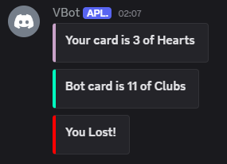
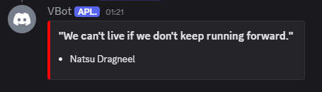

# VBotDiscord

VBotDiscord is a simple discord bot built with C# and DSharpPlus.
The goal is to create a lightweight bot with some useful and fun commands to help improve my C# skills.
Prefix for this bot is **`!`**.

---

## ✨ Current Features:
### Commands using `!`

### `!cardgame`
> Play a card game against the bot and see who has the better hand.

**Example Output:**

---

### Slash Commands

### `/animequote (character)`
> Get a random anime quote from your favourite character.

**Example Output:**

---

## 🔗 API Used

This bot currently uses the following public API to fetch anime quotes:

- [Vercel API](https://yurippe.vercel.app/) – for random anime character quotes.

---

## 📌 Notes

> The bot currently is in development and uses **guild-specific slash commands**.
> Global deployment is planned once features are finalized.
